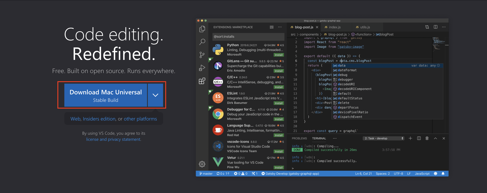
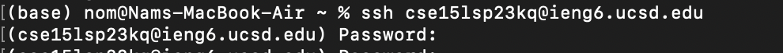

# Installing VScode
Go to visual studio code website [https://code.visualstudio.com/](https://code.visualstudio.com/) and download the latest stable build. Afterwards, open what 
you downloaded and following the installation instructions. 

* Download the most recent stable build by clicking in the box marked in red.

* Next, extract the application from the zip file you've downloaded and run it.
* You're done, VSCode should set up the default environment automatically!

Aftewards your VSCode should look like this 

# Remotely Connecting

* If you're using Windows, install [git bash](https://gitforwindows.org/), then follow the instructions [here](https://stackoverflow.com/questions/42606837/how-do-i-use-bash-on-windows-from-the-visual-studio-code-integrated-terminal/50527994#50527994) to use git bash in your VScode
  * Open VSCode, if not opened already, and press and hold `ctrl` + ` to open the terminal
  * Then open the command drop down menu by using `ctrl` + `shift` + `p`
  * Type - `Select Default Profile`
  * Select Git Bash
  * Then click on the `+` icon from the terminal window on the bottom right.
  * 
  * The dropdown next to the `+` icon should say bash, and you can swap between zsh, powershell, bash anytime.

* Then, to connect to the UCSD computers: first open your terminal and type in the text below.
  1. `ssh` + `your cse15 account name` + `@ieng6.ucsd.edu`. As an example `ssh cs15lsp23kq@ieng6.ucsd.edu` 
  2. It will prompt you to say (yes/no/[fingerprint])? Type `yes`
  3. Then type in your password

It should look like this

After you've inputted your password correctly, this should appear. You're in!

Error:
If you receive this error message, inquire your TA about this. This is completely beyond your ability.

# Trying Some Commands

Afterwards, you can some of these commands on your **personal computer** and the **remote computer**

* `cd ~` : this command will take you back to your Home folder.
* 
* `cd` : if you've noticed the output, this command acts the same way as the one above.
* `ls -lat` : this commands list `a` all files, in `l` long format, sorted by `t` date and time.
* 
* `ls -a` : this commands only list `a` all files
* 
* `cat /home/linux/ieng6/cs15lsp23/public/hello.txt` : this command reads and output line by line in the file `hello.txt`
* ~[img14](Screen Shot 2023-04-24 at 9.42.31 PM.png)
  
Then, to log out of the remote computer on your personal computer's terminal
  
* `Ctrl D`
* type `exit`
