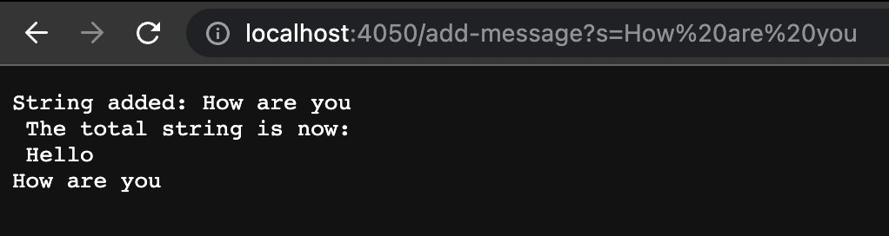

# Lab Report 2 - Servers and Bugs (Week 3) - Nam Nguyen

# Part 1 - String Server
Create a web server named "StringServer" which has the ability to follow the specified path and actions. The server should maintain a single string that receives updates from incoming requests. The format of the requests should be as follows:

```
/add-message?s=anystring
```
This concatenates a new line `\n` and the string that was inputted after the `=` onto the entire string.
The going to the home page with `\` should show


```
anystring
```

Then if you add another message

```
add-message?s=anotherone
```

Then the home page should show

```
anystring
anotherone

```

For example: 

* When we initialize the server, it should be empty like below. 

  * First we call our classes `Server` and `StringServer` in order to create a local host on our laptop
    * `javac Server.java NumberServer.java`
    * `java NumberServer 4000`
  * The reason the screen is empty is because our value `str` has nothing added to it yet/empty string, so the output is blank for now. 

* After entering in the URI `localhost:4000/add-message?s=Hello`, the output of the web server should look like this

  * By changing the URI, we are essentially creating a new `URI` variable to pass into our method `handleRequest`. 
  * Then `url.getPath()` turns the `URI` variable into a string so that we can read the path and match to our correct function.
  * Then `url.getQuery()` reads the query part of the URI, which is everything after the `?`
  * Then we add the string that comes after the `=` character into our total string and outputs it.

* Here we add another string to our existing string then output it to the screen. 

  * The process is the same except that we already have a previous string concatenated. 
  * Our `URI` and `parameters` variables changes again and we parse that to add to our existing string. 

* After we're done with adding our strings, we change our path to `\` and it outputs our current overall string.

  * Since our path is just `/`, `url.getPath()` will return `/` and it matches to our if statement.
  * It will only output and exit out of the if-else statement
  * Aside from the new `URI` that was entered, no other variables change.


# Part 2 - Bugs

Provide:

* A failure-inducing input for the buggy program, as a JUnit test and any associated code (write it as a code block in Markdown)
```
@Test
  public void testReverseInPlace2() {
    int[] input1 = {1, 2, 3, 4, 5, 6 };
    ArrayExamples.reverseInPlace(input1);
    assertArrayEquals(new int[]{ 6, 5, 4 ,3, 2, 1}, input1);
	}
  // actual output : {6, 5, 6}
```


* An input that doesn’t induce a failure, as a JUnit test and any associated code (write it as a code block in Markdown)
```
@Test 
	public void testReverseInPlace() {
    int[] input1 = { 3 };
    ArrayExamples.reverseInPlace(input1);
    assertArrayEquals(new int[]{ 3 }, input1);
	}
```

The symptom, as the output of running the tests (provide it as a screenshot of running JUnit with at least the two inputs above)


The bug, as the before-and-after code change required to fix it (as two code blocks in Markdown)

Before
```
static void reverseInPlace(int[] arr) {
    for(int i = 0; i < arr.length; i += 1) {
      arr[i] = arr[arr.length - i - 1];
    }
  }
``` 


* After
```
static void reverseInPlace(int[] arr) {
    for(int i = 0; i < arr.length/2; i += 1) {
      int opposite = arr[i];
      arr[i] = arr[arr.length - i - 1];
      arr[arr.length - i -1] = opposite;
    }
  }
```

The Fix
* We created a temporary variable `opposite` to store one of the two elements that we want to swap place with
* Then we set the left end as the right end element
* Then we set the right end as the temporary element that we stored.
* What's important is that the index must only go up to half of the array length. This is because if we keep looping, then it will swap back the elements resulting in the original string. 

# Part 3 - Something I learned from lab week 3

I learned how to write JUnit tests and the significance behind these tests in the industry.

* Frequently, we create methods within a class that interact with methods from other classes. With the increasing complexity of modern enterprise applications, it is common for a single method to call multiple methods from different classes.
*  When creating unit tests for these methods, we must use mocked data to simulate the behavior of the called methods. This is because the unit test should focus solely on testing the target method rather than all the methods it calls.

According to this [article](https://www.codeaffine.com/2014/08/18/junit-in-a-nutshell-test-structure/), there are 3 phases to JUnit testing.


1. To begin testing, the first step involves creating an object instance of the system being tested, which is commonly referred to as the System Under Test (SUT). This process also establishes the initial state of the SUT before any testing activities are conducted. This state serves as a clear and defined input for the test, and is known as the test fixture.

2. Once the setup is complete, it is time to call the SUT's methods that demonstrate a specific behavior which the test aims to confirm. In most cases, this involves calling only one method, and then recording the result in local variables.

3. The final part of the test is accountable for ensuring that the anticipated result of a particular behavior has been achieved.

Follow this [link](https://junit.org/junit5/docs/current/user-guide/) to read a more detailed documentation of JUnit tests.
