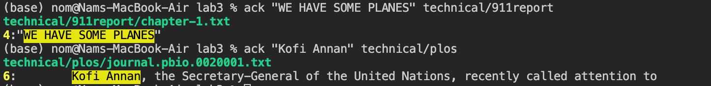
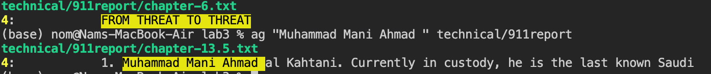
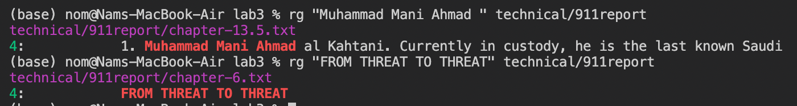
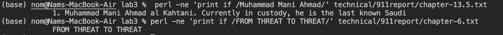

# Researching Commands
I'm choosing `grep` as my main command.

Current folder hierarchy:
- lab3
    - technical
        - 911report
            - txt.files
        - biomed
            - txt.files
        - government
        - plos
            - txt.files
    - lab3.md


# Example 1: "pattern" /path/to/directory

```
Input: ack "WE HAVE SOME PLANES" technical/911report

Output: 
technical/911report/chapter-1.txt
4:"WE HAVE SOME PLANES"
```

```
Input: ack "Kofi Annan" technical/plos

Output: journal.pbio.0020001.txt
```



Explanation: The `ack` command, also known as "ack-grep," is a tool specifically designed for code searching. It searches files and directories for patterns, excluding non-text files and version control directories by default. It supports Perl-compatible regular expressions and provides color highlighting.


# Example 2: ag "pattern" /path/to/directory

```
Input: ag "FROM THREAT TO THREAT" technical/911report
Output: technical/911report/chapter-6.txt
4:            FROM THREAT TO THREAT
```


```
Input: ag "Muhammad Mani Ahmad " technical/911report
Output: technical/911report/chapter-13.5.txt
4:            1. Muhammad Mani Ahmad al Kahtani. Currently in custody, he is the last known Saudi
```



Explanation: The `ag` command, also known as "The Silver Searcher," is a code searching tool that aims to be faster than grep. It ignores files and directories by default that are typically not useful in code searching, such as binary files and version control directories. Example usage:


# Example 3: rg "pattern" /path/to/directory

```
Input: rg "Muhammad Mani Ahmad " technical/911report
Output: technical/911report/chapter-13.5.txt
4:            1. Muhammad Mani Ahmad al Kahtani. Currently in custody, he is the last known Saudi
```

```
Input: rg "FROM THREAT TO THREAT" technical/911report
Output: 4:            FROM THREAT TO THREAT
```




Explanation: The `ripgrep` command, also known as rg, is a line-oriented search tool that recursively searches directories for a specified pattern. It is designed to be fast and efficient, and it supports searching with Perl-compatible regular expressions. Example usage:

# Example 4: perl -ne 'print if /pattern/'  /path/to/file.txt

```
Input: perl -ne 'print if /Muhammad Mani Ahmad/' technical/911report/chapter-13.5.txt
Output: 1. Muhammad Mani Ahmad al Kahtani. Currently in custody, he is the last known Saudi
```

```
Input: perl -ne 'print if /FROM THREAT TO THREAT/' technical/911report/chapter-6.txt
Output:            FROM THREAT TO THREAT
```



Explanation:  The `perl` command is a versatile scripting language that provides extensive text processing capabilities. It supports regular expressions and can be used for advanced pattern matching and text manipulation tasks. `-n` causes Perl to assume the following loop around your program, which makes it iterate over file name arguments somewhat like sed -n or awk. -e is used to enter one line of program, in other words, specify line by line.