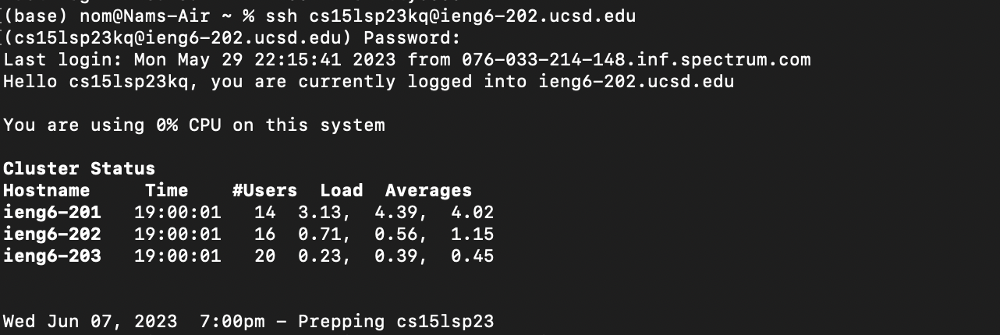
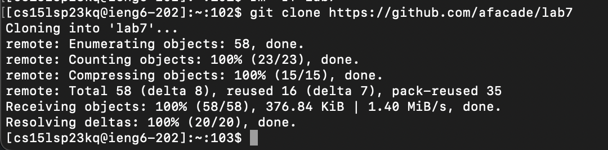
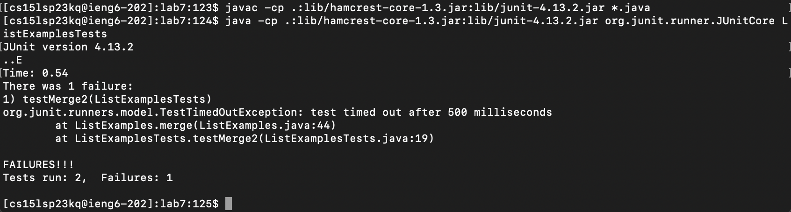
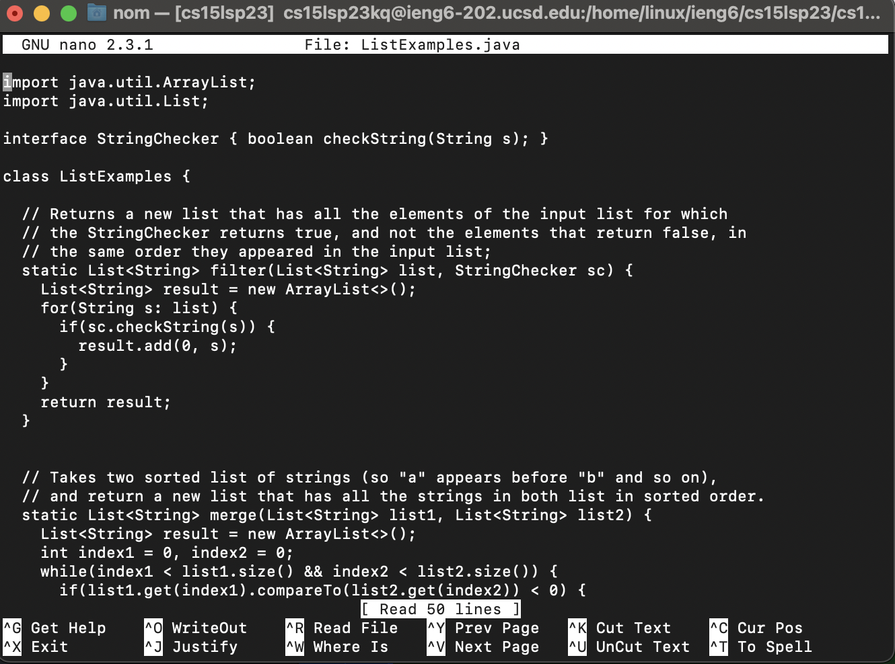
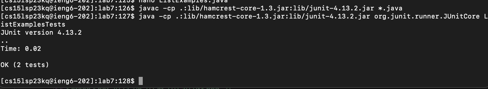
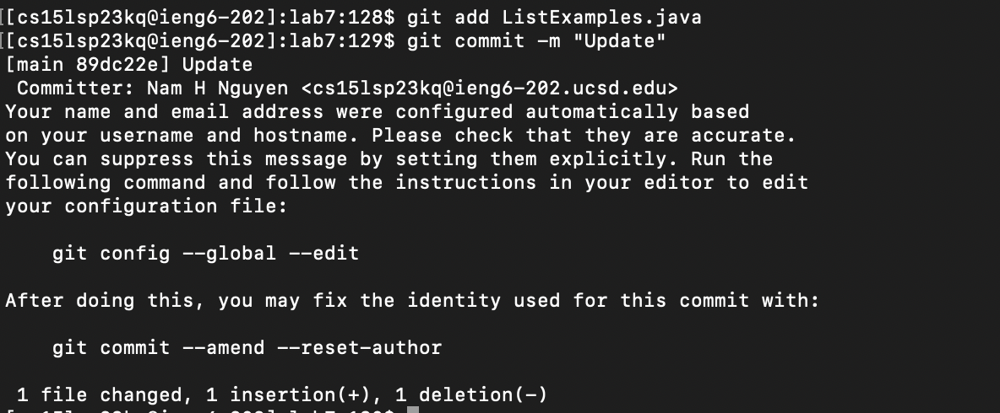
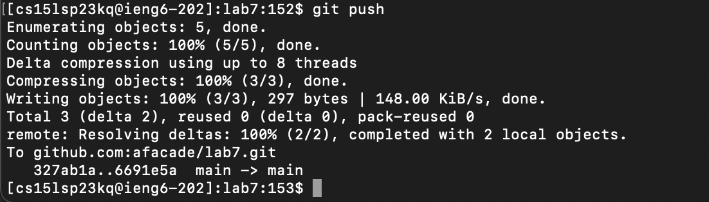

# Step 4
Since I logged in prevously, I pressed `<up><up` twice, passing the `exit` command, to get my login info `ssh cs15lsp23kq@ieng6-202.ucsd.edu`. Then I typed in my password to log in. 

# Step 5 
First I forked the repositoy from the github website to my own github, then I copied the url of the forked repository. Then I typed `git clone` + `repo's url` and hit `<enter>` to clone the repo to into my ieng6 account. 

# Step 6

First, I typed `cd lab7` and `<enter>` to get into the repo folder. Then I typed in `<up><up><up><up>` to find my java compile command `javac -cp .:lib/hamcrest-core-1.3.jar:lib/junit-4.13.2.jar *.java` and `<enter>`. Then I typed `<up><up><up>' again to find my run command `java -cp .:lib/hamcrest-core-1.3.jar:lib/junit-4.13.2.jar org.junit.runner.JUnitCore ListExamplesTests`.

# Step 7
To fix my error, I opened ListExamples in nano by typing `nano ListExamples.java` and `<enter>`.

As we can see in the last while loop, we see that the wrong index variable was incremented so we changed `index1 += 1` into `index2 += 1`. This solves our infinite loop problem since index2 wasn't incrementing, so the while loop could never exit. 

Afterwards, I pressed `<ctrl-o>` and `<enter>` to save the file. Then I pressed `<ctrl-x>` to exit nano back to my terminal.

# Step 8
To run the tests again, I recompiled the tests by typing `<up><up><up><enter>`. Then I pressed the same keys again, `<up><up><up><enter>` to run the tests.

# Step 9
In this final step, I needed to commit this file into my forked repository. So then, I typed `git add ListExamples.java` and `<enter>`. Then to commit, I typed `git commit -m "Update"` and pressed `<enter>`.

Then to  to push the changes onto the repository, I typed `git push` and `<enter>`.

