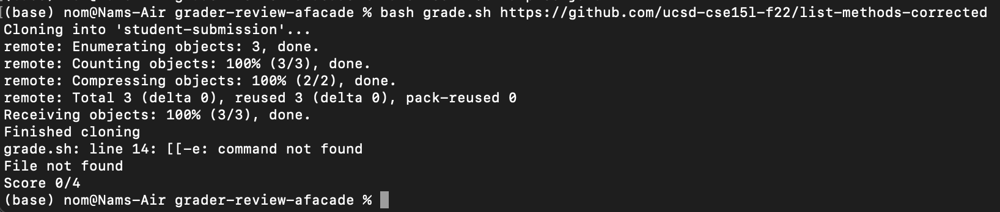
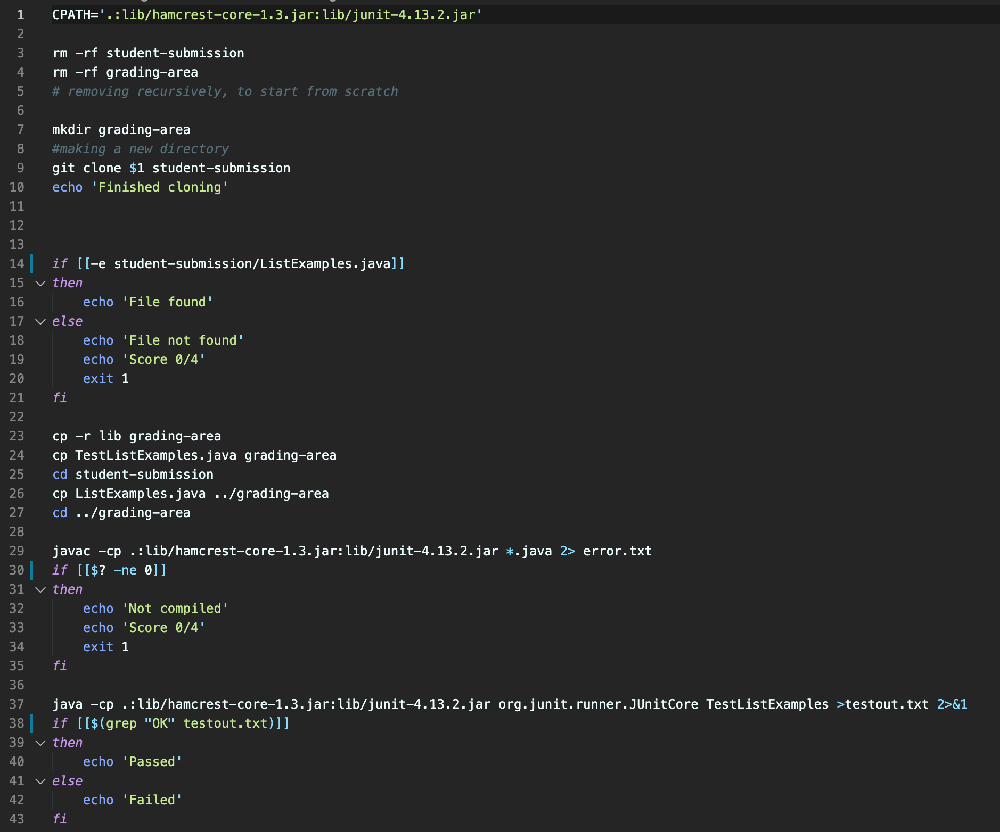
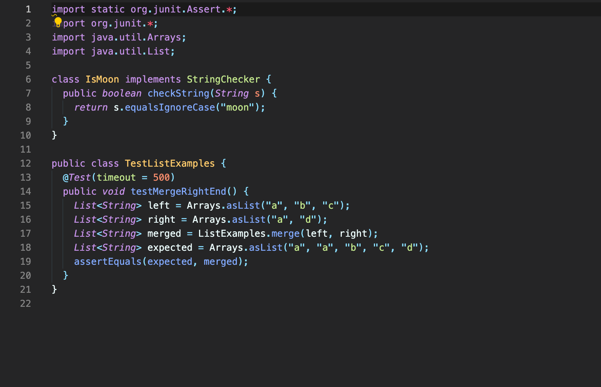
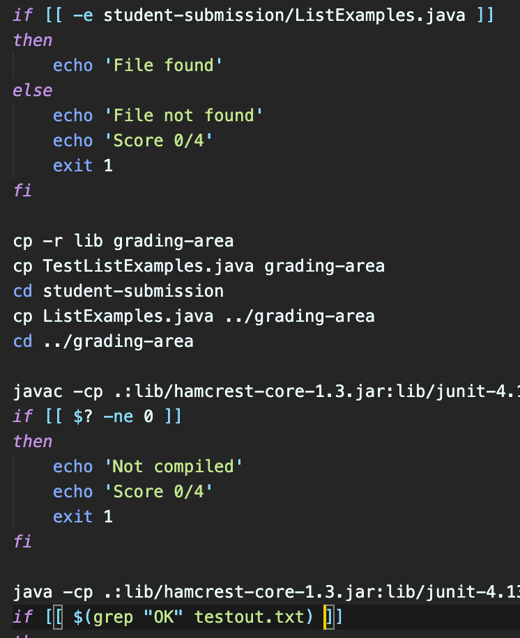
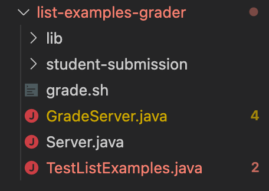

# Lab 5 - Debugging Scenario

## Part 1 Student Question

___

**What environment are you using (computer, operating system, web browser, terminal/editor, and so on)?**

I am using terminal on my local computer, a linux operating system.

**Detail the symptom you're seeing. Be specific; include both what you're seeing and what you expected to see instead. Screenshots are great, copy-pasted terminal output is also great. Avoid saying “it doesn't work”.**

Hi, I'm trying to run bash grade.sh for my lab task for week 6 where I'm pulling a student submission from a github repository and grading it. However, I'm getting an error on line 14 with `[[-e: command not found`. I've double-checked my code and I'm not sure why I'm getting this error?

**Detail the failure-inducing input and context. That might mean any or all of the command you're running, a test case, command-line arguments, working directory, even the last few commands you ran. Do your best to provide as much context as you can.**

Here is my grade.sh code:

And here is my tester file:

## Response from the TA team

Hi Nam!

It seems like you're not properly lining up the spaces with the square brackets. Worry not, this is a very special issue for new students who are learning linux command lines. Follow this [link](https://stackoverflow.com/questions/19032680/shell-spacing-in-square-brackets) here if you want to learn more about it. You should always have a space after `[` and before `]`. Let me know if you're still have trouble.

## Student followup

Hi TA!

Thank you for the response. I've put spaces after each square bracket and the code ran perfectly, thank you so much! I've pasted a screenshot below of my lines with proper spacing.

## The setup:
- The file & directory structure needed
    This scenario follows the week 6 lab that we had, where we have our servers and grader files outside. Additionally, we have the student's code file in student-submission
    
    

- The contents of each file before fixing the bug
    This is the content of `grade.sh` file before being fixed.
    

- The full command line (or lines) you ran to trigger the bug
    Used `bash grade.sh https://github.com/ucsd-cse15l-f22/list-methods-corrected` to test run the grader.

- A description of what to edit to fix the bug
    To fix the bug we needed to add a space after `[` and before `]`, of which the file did not correctly have.

# Part 2 – Reflection

This was a very memorable lab, a good course to take to train you in command lines. Shoutout to my tutor Genevieve, who was extremely dedicated and talented in guiding her lab group through each lab, she definitely made studying more that it should been. Additionally, the lab teaches very fundamental things about commmitting and pushing on github that's very helpful when you go into the industry and work. 

